# DeployGuard V1 deployment lifecycle

This is a deterministic controller for the single disposable `deployguard-demo-target` in the configured account. Its safety decisions are independent of the separate [GitHub PR advisory analysis](PR_ANALYSIS.md). The secondary deployment chat has read-only history/detail tools and cannot invoke deployment operations.

## State machine

```mermaid
stateDiagram-v2
    [*] --> analyzing: accept PR run / acquire target lock
    analyzing --> validating: immutable advisory analysis persisted
    analyzing --> rejected: PR or analysis unavailable
    [*] --> validating: accept candidate-only run
    validating --> smoke: candidate exists; distinct stable at 100%
    validating --> rejected: invalid or unavailable
    smoke --> starting_canary: preview checks pass
    smoke --> rejected: failed or inconclusive
    starting_canary --> canary: write 90/10; verify active deployment
    canary --> canary: inconclusive; deadline not reached
    canary --> awaiting_approval: health policy passes
    awaiting_approval --> canary: evidence becomes inconclusive; invalidate approval
    awaiting_approval --> promoting: valid explicit approval
    canary --> rolling_back: unhealthy or deadline
    awaiting_approval --> rolling_back: unhealthy or deadline
    promoting --> rolling_back: evidence expired before write
    promoting --> verifying_promotion: write candidate 100%; verify
    verifying_promotion --> promoted: 30 seconds of healthy production probes
    verifying_promotion --> rolling_back: failure or 60-second deadline
    verifying_promotion --> needs_attention: control-plane drift or outage
    rolling_back --> verifying_rollback: write stable 100%; confirm allocation
    verifying_rollback --> rolled_back: 30-second healthy stable traffic window
    verifying_rollback --> needs_attention: 90-second timeout, drift or unavailable control plane
    starting_canary --> needs_attention: unconfirmed mutation
    promoting --> needs_attention: unconfirmed mutation or drift
    rolling_back --> needs_attention: unconfirmed mutation or drift
    canary --> needs_attention: deployment drift or unavailable control plane
    awaiting_approval --> needs_attention: deployment drift or unavailable control plane
    needs_attention --> rolling_back: reconcile confirmed own mutation
    needs_attention --> verifying_rollback: confirmed stable restoration; no ambiguous write
```

`evaluate()` is a pure function used during `canary`, `awaiting_approval`, promotion preflight, and `verifying_promotion`; it returns `healthy`, `unhealthy`, or `inconclusive`. An operator may also request rollback from an active run when ownership can be established and no mutation is unresolved.

Only `rejected`, `promoted`, and `rolled_back` release the run lock. `needs_attention` holds it. Terminal runs and transition reasons remain in SQLite-backed Durable Object storage. A new run snapshots the policy constants so a later code change does not silently change an active run's thresholds.

## Fixed demo safety policy

| Rule                  | V1 value / behavior                                                                                                                         |
| --------------------- | ------------------------------------------------------------------------------------------------------------------------------------------- |
| Target                | Hard-coded account, Worker and two endpoint URLs; callers submit only candidate UUID                                                        |
| Starting state        | Exactly one different stable version at 100%; candidate must exist in this target                                                           |
| Smoke                 | Candidate version URL; both endpoints must return attributed, valid HTTP 200 responses                                                      |
| Canary                | Stable 90%, candidate 10%; explicit read-back before collecting health                                                                      |
| Probe cadence         | Four requests per alarm batch: both endpoints on both versions, pinned using version overrides; approximately every five seconds            |
| Attribution           | Response UUID must match requested version. Header/body UUID, release, request ID, cache policy and endpoint content must agree             |
| Minimum evidence      | At least 30 seconds of observation, and 10 distinct samples per endpoint per version in the last 60 seconds (40 total minimum)              |
| Freshness             | Each endpoint/version group must have evidence no older than 15 seconds                                                                     |
| Error allowance       | Candidate ≥3 HTTP errors and >20% absolute or >5pp above stable triggers rollback; stable >10% is inconclusive                              |
| Latency               | Each endpoint/version p95 ≤ 2,000 ms; candidate p95 ≤ max(2 × stable p95, stable p95 + 100 ms)                                              |
| Missing evidence      | Timeouts, unknown version, insufficient samples, invalid timings, or stale evidence are inconclusive; never healthy                         |
| Inconclusive handling | Keep current canary allocation while collecting evidence; invalidate outstanding approval; restore stable at the deadline                   |
| Exposure deadline     | 180 seconds from confirmed canary; no deadline extension on reevaluation                                                                    |
| Approval              | Always required, tied to run UUID and a newly issued approval UUID; expires after 60 seconds; health and deployment ownership are rechecked |
| Approval wait         | Probing continues. Health loss invalidates approval; failure or expiry initiates rollback                                                   |
| Mutations             | Persist intent before POST; no `force`, no blind POST retries; read back allocation and run-specific annotation                             |
| Confirmation deadline | Retry read-back on subsequent alarms for up to 30 seconds; then hold the lock in `needs_attention`                                          |
| Rollback              | Original stable version at 100%, plus a clean ordinary-traffic verification window before success                                           |

These are deliberately strict demo thresholds, not statistically calibrated production SLOs. Probe latency includes networking and is not CPU time. A successful runtime invocation does not establish HTTP success, so the policy uses HTTP status and content directly. The greeting check requires a string ending in `, DeployGuard!`; it permits the intended Hello → Hi candidate change.

Unknown observations remain in the rolling window until they age out. Critical assertion failures trigger rollback before minimum sample counts. HTTP failures are evaluated after the observation/sample requirements. Isolated HTTP errors do not trigger immediate rollback; unknown attribution still prevents promotion. A bad stable baseline does not justify promoting the candidate. Policy version 3 is used for new runs. Nonterminal runs from an older policy are held in `needs_attention`; explicit rollback/reconciliation remains available before starting a fresh run.

## Rollback traffic verification

`verifying_rollback` retains the target lock after Cloudflare confirms stable at 100%. Each alarm sends ordinary requests to both endpoints with **no version override**. Completion requires at least seven distinct passing samples per endpoint spanning at least 30 seconds, fresh within 15 seconds, with no gaps over 15 seconds. Every sample must have the stable version header, matching response contract, and latency at most 2 seconds.

A candidate response, missing attribution, HTTP error, assertion failure or invalid/slow sample restarts the clean interval across both endpoints. An observation gap requires a fresh interval. The fixed 90-second deadline begins at allocation confirmation and is not extended by failures or process restarts. On timeout the run becomes `needs_attention` and retains its lock; deployment drift or an unavailable control plane also prevents success. Stable allocation is rechecked before and after probing. The controller does not repeat rollback writes during propagation.

Rollback evidence is stored separately in `run.rollbackVerification`, preserving the original failure samples. `observedVersion` records returned header attribution even when it differs from the intended version. The combined API exposes the rollback deadline and counts from rollback evidence while disabling repeated rollback commands during verification. Explicit reconciliation of stable allocation starts a new bounded verification attempt; it never directly marks the run complete. Old-policy recovery uses the new rollback verification policy, while historical terminal records remain unchanged.

These are sampled requests from the coordinator, not proof of zero candidate traffic worldwide. The live rerun is documented in [rollback verification](demo-worker/ROLLBACK_VERIFICATION.md).

## Implementation

- `src/deployment/lifecycle.ts`: persisted run model, pure health evaluation, transitions, write-ahead mutation intent and reconciliation.
- `src/deployment/cloudflare.ts`: bounded Cloudflare REST requests, response validation, and fixed-endpoint probes. API credentials are sent only to `api.cloudflare.com`.
- `src/deployment/controller.ts`: one SQLite-backed Durable Object, HTTP command validation/authentication, serialized execution, persisted current run/history and alarms.
- `src/server.ts`: routes every deployment request to the same `demo-target` instance. The generic Agents router receives only the ChatAgent binding, preventing alternate coordinator instances through that router.
- `wrangler.jsonc`: adds the coordinator binding and an additive `v2` migration; existing chat storage is preserved.

An alarm is armed before durable work is accepted and before each tick, allowing recovery after interruption. Calls are serialized across awaits inside the coordinator, while the durable nonterminal run prevents overlaps across restarts. This lock covers DeployGuard requests; it does not lock out Wrangler or the Cloudflare dashboard.

The current implementation uses Durable Object alarms rather than adding Workflows for this small fixed lifecycle. It never waits for a human inside an HTTP request. A future larger workflow can call the same policy/controller boundaries without delegating safety decisions to an LLM.

## API and configuration

The controller is disabled with HTTP 503 until both secrets exist:

- `DEPLOYGUARD_API_TOKEN`: account-scoped Cloudflare API token with Workers Scripts Write permission for the existing account.
- `DEPLOYGUARD_ADMIN_TOKEN`: separate strong bearer token for the developer operating this demo.

For local use, add them to ignored `.dev.vars`; use Wrangler secrets for a deployed controller. Neither credential is bundled into the frontend. The deployed verification uses dedicated user-provided Cloudflare/GitHub tokens and a separate generated admin secret. See [live backend verification](BACKEND_VERIFICATION.md).

API clients use `Authorization: Bearer <DEPLOYGUARD_ADMIN_TOKEN>`. The dashboard uses a signed HttpOnly session cookie, authenticated at the Worker boundary and translated to the same controller authorization. Cookie writes and chat handshakes require the same origin.

| Method / path                    | JSON body or result                                                                     |
| -------------------------------- | --------------------------------------------------------------------------------------- |
| `GET /api/deployment`            | Current run, evidence, approval ID, transition history and confirmed deployment         |
| `GET /api/deployment/history`    | Up to 100 persisted runs (key-limited, then sorted by creation time; no pagination yet) |
| `GET /api/deployment/state`      | Current run plus linked analysis, health counts, deadlines and available actions        |
| `GET /api/deployment/<run-id>`   | Same combined view for a historical run                                                 |
| `POST /api/deployment/start`     | `{ "candidate": "<version-uuid>", "analysisId": "<optional-analysis-uuid>" }`           |
| `POST /api/deployment/approve`   | `{ "runId": "<run-uuid>", "approvalId": "<approval-uuid>" }`                            |
| `POST /api/deployment/rollback`  | `{ "runId": "<run-uuid>" }`                                                             |
| `POST /api/deployment/reconcile` | `{ "runId": "<run-uuid>" }`                                                             |

Accepted commands return 202. Inspect the current run for completion; acceptance is not a successful deployment. Invalid state/stale commands return 409. There is no endpoint to submit health evidence or modify safety thresholds.

## Integrated PR run

A single `POST /api/deployment/start` can accept `candidate`, `prUrl`, and optional `expectedCommitSha`. It persists the run and acquires the target lock before GitHub or AI work begins. An alarm performs analysis, records its ID and immutable source on the run, and moves into validation, smoke and canary processing. `prUrl` and an existing `analysisId` are mutually exclusive. An expected SHA mismatch rejects the run before traffic changes.

The analysis checkpoint can reuse a completed record after interruption. An interrupted incomplete analysis rejects the run rather than blindly repeating inference. The linked analysis remains available for inspection. Reads bypass the mutation queue so the frontend can observe a persisted run while analysis is running. No model-generated field is read by promotion or rollback policy.

The combined read view exposes persisted evidence, not a fresh Cloudflare API read; action availability is advisory and each command rechecks safety and ownership. Historical run records preserve their observed deployment IDs even after later runs change the target.

## Failure recovery and constraints to resolve

1. **External writers:** Cloudflare's deployment API does not expose a compare-and-swap precondition in the documented create operation. Preflight checks detect changed deployment IDs, but cannot eliminate a race with a concurrent dashboard/Wrangler deployment between GET and POST. Use this controller as the sole writer during a run.
2. **Ambiguous writes:** A timed-out POST may have applied. The controller waits for an allocation plus its run annotation, never retries the POST blindly, and retains the lock if uncertain. Reconciliation can recover an observed own mutation and roll it back, or begin traffic verification of observed stable restoration when there is no unresolved write. If a pending mutation never appears, the lock intentionally remains held—even if an old stable deployment is still active. An explicit operator recovery procedure for definitively abandoned writes is still needed before unattended use; there is no unsafe force-unlock endpoint.
3. **Unavailable control plane:** If current Cloudflare state cannot be read, the controller cannot safely promise rollback. It records `needs_attention` and retains the lock. A canary may remain live beyond the nominal deadline during an outage; the deadline is a requested safety action, not a platform guarantee. An operator alert path should be added before unattended use.
4. **Demo evidence:** This implementation compares controlled synthetic requests, not all organic traffic. It does not ingest GraphQL metrics or stored logs. Validate thresholds against real network variance and add production telemetry before claiming production coverage.
5. **Approval identity:** The shared admin token is sufficient for one developer and one demo target. Dashboard authentication, attribution to a human identity and a visible approval/recovery screen should precede broader access.
6. **Bounded post-promotion coverage:** Success now requires a short production probe window. The stable baseline is frozen because the old version cannot be selected by an override once removed from the active deployment. This does not establish global propagation or long-term health. Live rehearsal remains recommended.
7. **Alarms and preview limitations:** Alarms can be retried or delayed, so operations must remain idempotent/reconcilable. Preview smoke tests rely on HTTP responses because version URLs do not provide normal Worker logs. The target remains stateless; rollback cannot reverse external data writes.

## Tests and checks

Run `npm test` on a Node version with native TypeScript support (tested on Node 26.7). No test framework dependency was added. `npm run check` includes TypeScript, lint and formatting for these modules.

Focused automated cases cover healthy approval/promotion; unhealthy rollback; inconclusive deadline rollback; wrong, expired and replayed approvals; invalidation after telemetry loss; delayed promotion; overlapping runs across controller reconstruction; validation/smoke failure; lost mutation response; unconfirmed mutation; failed rollback; external drift; control-plane outage; sample coverage/freshness/latency; HTTP regression thresholds; post-promotion success, failure and timeout; and Cloudflare adapter URL, attribution and API validation.

A separate local Workers runtime check exercises unauthorized access, simultaneous starts, and persistence across a runtime restart with outbound networking disabled. The full Vite Worker/frontend build is also checked. The actual deployed Worker/Durable Object flow is recorded in [live backend verification](BACKEND_VERIFICATION.md). The earlier manual deployment verification is recorded separately in `demo-worker/VERIFICATION.md`.

## Current official references

- [Create Worker Deployment](https://developers.cloudflare.com/api/resources/workers/subresources/scripts/subresources/deployments/methods/create/): percentage allocation, annotations and required permission.
- [Version overrides](https://developers.cloudflare.com/workers/versions-and-deployments/version-overrides/): pinning active versions; fallback requires response attribution checks.
- [Version URLs](https://developers.cloudflare.com/workers/versions-and-deployments/version-urls/): independent smoke testing and limitations.
- [Durable Object rules](https://developers.cloudflare.com/durable-objects/best-practices/rules-of-durable-objects/): persistent coordination and concurrency.
- [Durable Object alarms](https://developers.cloudflare.com/durable-objects/api/alarms/): durable scheduling and retries.
