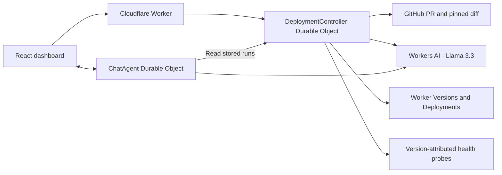

# DeployGuard

An AI-assisted dashboard that explains a pull request, tests a Cloudflare Worker canary, and promotes or rolls it back using deterministic health rules. Deployment history and a read-only chat help explain what happened and why.

**[Open the live demo →](https://deployguard.jlaadithya.workers.dev)** · [Development prompts](PROMPTS.md)

## Try it

No sign-in, API keys, or local setup is needed for the deployed demo.

1. Open the dashboard and choose **Try a successful deployment** or **See automatic rollback**.
2. Follow the PR analysis, smoke tests, traffic split, and live health evidence.
3. For the healthy demo, approve when prompted. It temporarily promotes the candidate, verifies health, then restores stable. The failure demo rolls back automatically.
4. Open a run in **History**, then use **Ask DeployGuard → Explain this run** to ask about its outcome and evidence.

Allow a few minutes per run. The demos change traffic on a disposable Worker and run one at a time; they continue if you close the browser. A healthy demo can also roll back if approval expires or evidence is inconclusive. GitHub PR links require repository access, but their stored analyses are visible in the dashboard.

## How it works



The controller runs **PR analysis → validation → smoke test → 90/10 canary → approval/promotion or rollback**. Durable Object alarms continue the work independently of the browser. Recovery requires both a confirmed stable allocation and healthy ordinary traffic.

AI summarizes changes, estimates risk, and suggests checks. **Only deterministic policy and explicit approval control deployment changes.** Chat can inspect stored runs but cannot mutate deployments.

| Component    | Implementation                                                                |
| ------------ | ----------------------------------------------------------------------------- |
| LLM          | Llama 3.3 on Workers AI for PR analysis and chat                              |
| Coordination | Cloudflare Worker routing and a Durable Object state machine                  |
| User input   | React dashboard and Ask DeployGuard chat                                      |
| Memory       | Persistent deployment history, analyses, and chat messages in Durable Objects |

## Run and test locally

Use Node.js 24+ and a Cloudflare account with Workers AI access.

```sh
npm ci
npx wrangler login
```

Create an ignored `.dev.vars` file:

```dotenv
DEPLOYGUARD_ADMIN_TOKEN=<your-dashboard-admin-secret>
DEPLOYGUARD_API_TOKEN=<cloudflare-token-with-workers-scripts-write>
GITHUB_TOKEN=<github-token-with-repository-read-access>
```

```sh
npm run dev         # Open the URL printed by Vite
npm test           # Deterministic lifecycle, analysis, and access tests
npm run check      # Formatting, lint, and TypeScript
npm run demo:check # Disposable target checks
```

Workers AI uses a remote binding; local storage starts separately from the hosted history. To run deployments in your own account, configure the target in `src/deployment/cloudflare.ts`, upload your stable/candidate versions, and update the demo presets. See [setup and deployment details](docs/OPERATIONS.md) and [target Worker instructions](demo-worker/README.md). `npm run deploy` publishes the dashboard/controller; deployed secrets must be configured separately.

## Scope and further reading

This prototype manages one account and one disposable target. Synthetic probes do not establish global production health, and associating a PR with a version is not a build attestation. The controller should be the only deployment writer during a run.

- [Lifecycle, safety policy, and API](docs/DEPLOYMENT_LIFECYCLE.md)
- [PR analysis and AI boundaries](docs/PR_ANALYSIS.md)
- [Operations, authentication, and limitations](docs/OPERATIONS.md)
- [Latest live verification](docs/verification/RENAME_VERIFICATION.md)

Built from the official [Cloudflare Agents starter](https://github.com/cloudflare/agents-starter). DeployGuard adds the deployment controller, PR analysis, health policy, dashboard, and reviewer demos. AI-assisted development prompts are recorded in [PROMPTS.md](PROMPTS.md).
